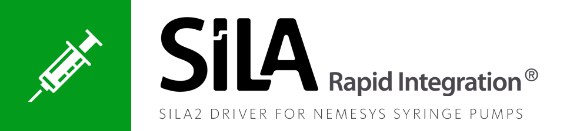

 

# neMESYS SiLA2 driver
This repository contains the official [SiLA2](https://sila-standard.com/) driver for the [neMESYS High Precision Syringe Pumps](https://www.cetoni.com/products/pumps). This SiLA2 driver is based on the [Qmix SDK for Python](https://github.com/CETONI-Software/qmixsdk-for-python) for device control of the neMESYS pumps.

The folder **neMESYS_impl** contains the SiLA2 driver for the master branch of the [SiLA2 Python Library](https://gitlab.com/SiLA2/sila_python).  
The folder **neMESYS_impl-mod** contains the SiLA2 driver for the 
[codegenerator-mod branch](https://gitlab.com/SiLA2/sila_python/tree/codegenerator-mod) of the 
[SiLA2 Python Library](https://gitlab.com/SiLA2/sila_python).

# Getting Started
> ### Note:
> These SiLA2 drivers were developed under Linux (Ubuntu 19.04) and are therefore expected to work on Linux systems, other operating system should work as well, but have not been tested yet!

## Install required dependencies
The SiLA2 drivers in this repository need the following dependencies to work correctly:
* SocketCAN driver (either [SysTec](https://www.systec-electronic.com/en/company/support/device-driver/) or [IXXAT](https://www.ixxat.com/support/file-and-documents-download/drivers/socketcan-driver) depending on your CETONI base module)
* QmixSDK for Python
* SiLA2 Python Library
* (gRPC Library + protobuf compiler `protoc`)

### QmixSDK installation
For instructions on how to install the QmixSDK for Python on your system and get a valid Qmix configuration for your pumps see the [QmixSDK Documentation](https://www.cetoni.de/fileadmin/user_upload/Documents/Manuals/QmixSDK/index.html).

### SiLA2 Python Library installation
> Note: The SiLA2 Python Repository is currently under development since the SiLA2 standard itself is still not completely ready. There will definitely be some breaking changes in the near future, which might lead to equally big changes in this repository, as well.

Follow the instructions in the [README.md](https://gitlab.com/SiLA2/sila_python) in the repository of the SiLA2 Python reference implementation (*Tip: If you want to use python virtualenv, set up a virtualenv **before** you run the installtion script and don't let the installer create one for you!*). This automatically installs the gRPC library and the protobuf compiler `protoc`. Now you are ready to use the driver in the `neMESYS_impl` directory and build it yourself, if you like to (See [Building the drivers](#building-the-drivers) for more details on how to build the drivers yourself).

However, I recommend you use the improved version of the SiLA2 code-generator. If you cloned the repository, you need to checkout the corresponding branch `codegenerator-mod`. Again follow the instructions in the [README.md](https://gitlab.com/SiLA2/sila_python). Then change into the `sila_tools/SiLA2CodeGeneratorPackage/` directory and follow the installation instruction in this directory's [README.md](https://gitlab.com/SiLA2/sila_python/blob/codegenerator-mod/sila_tools/SiLA2CodeGeneratorPackage/README.md). To see if the installation is complete, run 
```shell
SiLA2CodeGenerator --help
```

## Running SiLA2 neMESYS servers
As described above, the `neMESYS_impl*` directories already contain fully functioning SiLA2 drivers. The fastest way to get something up and running is by just running the `SiLA_neMESYS.py` script in the `neMESYS_impl-mod` directory giving it a path to a valid Qmix configuration folder:
```shell
$ python3 SiLA_neMESYS.py ~/Documents/my_qmix_config
```
This requires you to have all necessary environment variables set (i.e. `$PATH`, `$PYTHON_PATH` and `$LD_LIBRARY_PATH`) to point to the correct paths of your QmixSDK's root directory, python directory and lib directory, respectively. See the [QmixSDK for Python Documentation](https://www.cetoni.de/fileadmin/user_upload/Documents/Manuals/QmixSDK/QmixSDK_Python.html) for more information on this.  
If you don't have these variables set yet, you can also use the provided wrapper shell script in this repository. Before you use it, make sure the script uses the correct path to your QmixSDK installation. Simply edit the `$QMIXSDK_PATH` variable to point to the correct directory. Then you can run simply run the SiLA neMESYS server like this:
```shell
$ ../qmixsdk-py_wrapper.sh SiLA_neMESYS.py ~/Documents/my_qmix_config
```

You can test and play around with the currently implemented SiLA2 Features by running the `neMESYS_impl-mod/neMESYS_Client.py` in a different terminal or you can use UniteLabs' SiLA Browser. You can download SiLA Browser from [here](http://www.unitelabs.ch/technology/plug-and-play/try-it-out). It runs as a web application in the browser (usually on port 8080) and should discover running SiLA2 neMESYS servers itself. If not, you can also manually enter the ports the SiLA2 neMESYS servers are running on (by default it's port 50051 and up, depending on the number of pumps you have).

# Building the drivers
If, however, you want to change the implementation or if you want to add new SiLA Features, you can rebuild the driver(s) yourself. Depending on what driver you want to use, you need to have the correct codegenerator installed (see section [SiLA2 Python Library installation](#sila2-python-library-installation)). 

## Using the original codegenerator from the master branch
From this directory (`sila_nemesys`) run the following command:
```shell
$ sila2codegenerator -d .
```
This generates the protobuf files and sample implementations for the server/client and puts them in the `neMESYS_build` directory. If you added a new SiLA2 Feature just copy the new files into the `neMESYS_impl` directory and add your own implementations.  
If you just changed or added a property or a command to a Feature you only need to copy the corresponding lines that changed in the server/client implementations. This means, if you change something in the Feature Definition of the `PumpDriveControlService` you need to copy the modified lines of the following files:
* `neMESYS_build/neMESYS_server.py`
* `neMESYS_build/neMESYS_client.py`
* `neMESYS_build/PumpDriveControlService_servicer.py`
* `neMESYS_build/PumpDriveControlService_simulation.py`
* `neMESYS_build/PumpDriveControlService_real.py`

Further you need to copy the following files entirely:
* `neMESYS_build/PumpDriveControlService.pickle`
* `neMESYS_build/PumpDriveControlService_pb2.py`
* `neMESYS_build/PumpDriveControlService_pb2_grpc.py`

To simplify this process you can use a tool like [Meld](https://meldmerge.org/), for example, which lets you compare whole directories and highlights the changes for you.

Then add your implementations for the new properties or commands.

## Using the modified codegenerator
To use the modified codegenerator developed by Timm Severin you need to run the following command from the current directory:
```shell
$ SiLA2CodeGenerator -o neMESYS_build-mod -b .
```
This puts all the generated files into the `neMESYS_build-mod` directory. Similarly you need to copy new files to the `neMESYS_impl-mod` directory or copy the corresponding modfied lines.  
For the example from above, you need to copy the modified lines of the following files:
* `neMESYS_build-mod/neMESYS_server.py`
* `neMESYS_build-mod/neMESYS_client.py`
* `neMESYS_build-mod/PumpDriveControlService/PumpDriveControlService_servicer.py`
* `neMESYS_build-mod/PumpDriveControlService/PumpDriveControlService_simulation.py`
* `neMESYS_build-mod/PumpDriveControlService/PumpDriveControlService_real.py`

Further you need to copy the following files/directories entirely:
* `neMESYS_build-mod/meta/PumpDriveControlService.pickle`
* `neMESYS_build-mod/PumpDriveControlService/grpc/`
* `neMESYS_build-mod/PumpDriveControlService/PumpDriveControlService_default_arguments.py`

Then add your implementations for the new properties or commands.

# Contributing
You can change and improve the current implementations, create new commands, properties, or even whole new SiLA2 Features. If you think your changes might be interesting for other us and users as well, feel free to open a pull request.  
Also if you have any questions or problems with the drivers, just open an issue and we'll try to help you.
